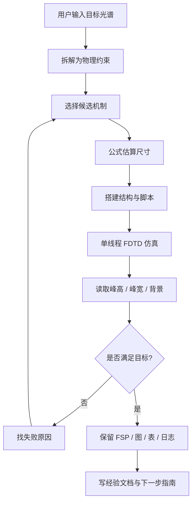
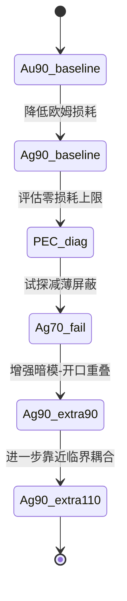

# 本次项目全流程工作日志

## 1. 项目目标

这次任务的目标非常明确：不是做一个“看起来复杂”的结构，而是得到一条满足下面条件的透射谱：

- 背景尽量接近 0。
- 只保留一个向上的窄峰。
- 峰尽量尖，半峰宽尽量小。
- 峰值尽量高。

同时还要满足过程约束：

- 每次真实 FDTD 仿真前都要检查是否已有其他 `.fsp` / Lumerical 线程在运行。
- 只能单线程顺序仿真，不能并行。
- 每一次改动都必须有物理依据，不能靠无缘由试错碰运气。

## 2. 用户输入如何被拆解

用户最初的要求可以拆成四层：

1. 结构层面：从对称性和物理机制出发，设计一个可形成尖锐峰的结构。
2. 计算层面：把结构放进 FDTD，并保留原始 `.fsp` 和结果文件。
3. 结果层面：峰要尖、要高、背景要干净。
4. 方法层面：整个过程要可复用，后续还能继续生成别的结构。

这意味着本项目不是单次仿真，而是一个“机制假设 -> 结构搭建 -> 单线程验证 -> 结果反推 -> 再优化”的闭环。

## 3. 总体流程图



## 4. 全流程时间线

### 第一阶段：目标定义和机制起点

最早的任务不是“先画结构”，而是先回答：什么机制才可能同时实现低背景和窄峰。

这一步采用了三条基础线索：

- D4 对称性下的对称保护 BIC / 准 BIC。
- 环形暗模的尺度估算。
- 金属屏蔽层压低背景。

对应的近似关系是：

```text
lambda0 ~= 2*pi*n_eff*R_eff / m
delta = eta / R_eff
gamma_rad proportional to delta^2
Q_rad proportional to 1 / delta^2
```

### 第二阶段：结构落地

在物理机制确定后，才开始把结构落到 D4 双环八缝耦合腔上：

- 外环和内环提供暗模主体。
- 对角裂缝成对失谐 `eta` 用来弱打开准 BIC。
- 金属屏蔽层负责压背景。
- 八个方向的开口负责把暗模和外界通道耦合起来。

### 第三阶段：mesh=1 的早期成功

mesh=1 下曾得到一个很强的候选点，峰值高、背景低，说明机制方向是对的。但当用户把 mesh accuracy 提到 2 后，峰值明显塌缩，说明最窄金属缝根本没有被收敛解析。

这一步的意义不是“失败了”，而是把一个重要事实钉死了：

- 原本结构中存在未收敛的窄缝。
- 如果不先解决网格解析问题，任何峰值都不可信。

### 第四阶段：mesh=2 收敛修正

为了让结果可验证，后续尝试围绕可解析结构重新设计，并严格只跑单线程。

先后经历了几类尝试：

- 4 nm 局部 mesh 直接解析窄缝。
- 10 nm 局部 mesh + 放宽窄缝。
- 全局 mesh=2 的可解析结构。

结果表明，网格收敛与几何可解析性是前提，不是附加项。

### 第五阶段：从 Au 到 Ag

在保持背景抑制机制不变的前提下，先换金属材料：

- Au 屏蔽层作为基线。
- Ag 屏蔽层作为低损耗材料验证。

这是一次有明确物理依据的改动，因为它对应的是吸收损耗 `gamma_i`。

结果显示，Ag 相比 Au 的确能明显提高峰高，同时保持背景较干净。

### 第六阶段：PEC 只做上限诊断

接着做了 PEC 诊断，只是为了判断“如果把欧姆损耗完全拿掉，会发生什么”。

这个诊断的结果触发了场发散，谱线数值异常，不可作为物理解读。它只说明：

- PEC 可以作为零损耗上限的思考工具。
- 但它不适合作为真实工艺方案，也不适合作为最终光谱结论。

### 第七阶段：Ag70 的反证

在 Ag 90 nm 的基础上减薄到 70 nm，结果峰值反而下降，背景抬高。

这一步非常关键，因为它说明：

- 厚度不是越薄越好。
- 屏蔽层不仅承担吸收损耗，还承担背景抑制和边界相位控制。
- 盲目减薄会打开非共振泄漏。

### 第八阶段：真正有效的耦合增强

随后把焦点放在开口与暗模的径向重叠上，逐步增加 `screen_aperture_extra_length_nm`：

- extra90 把峰明显抬高。
- extra110 进一步把峰推到 `0.8327`，同时峰仍然尖，背景仍可接受。

这一步说明，当前最有效的物理抓手不是继续减薄金属，而是增强“暗模与开口的重叠耦合”，让系统接近更好的临界耦合点。

## 5. 过程中遇到的问题与解决方法

| 问题 | 表现 | 解决方法 | 成效 |
|---|---|---|---|
| 窄缝未收敛 | mesh=1 到 mesh=2 后峰值塌缩 | 回到可解析缝宽，重建几何 | 结果可信了 |
| 局部 mesh 过慢 | 预估几十到数百小时 | 放弃不可承受的局部高分辨率方案 | 保护了时间预算 |
| Ag 材料名不合法 | Lumerical 报错 | 改成正确材料名 `Ag (Silver) - Palik (1-10um)` | 仿真可继续 |
| PEC 发散 | 场值异常，谱线失真 | 把 PEC 仅当作诊断，不当成结果 | 避免误判 |
| 厚度盲调 | Ag70 变差 | 停止厚度碰运气，转向耦合重叠 | 找到有效方向 |
| 参数映射 bug | `extra_length` 没有真正更新到几何 | 修正脚本中的 `screen_aperture_length_nm` 更新逻辑 | 让后续仿真与声明一致 |

## 6. 结果演化



结果汇总：

| 结构 | 峰高 | FWHM | 背景 p95 | 结论 |
|---|---:|---:|---:|---|
| Au90 基线 | 0.2871 | 3.67 nm | 0.00548 | 能用，但峰不够强 |
| Ag70 | 0.2052 | 3.84 nm | 0.00980 | 变差，停止减薄 |
| Ag90 extra90 | 0.6502 | 3.15 nm | 0.00912 | 明显提升，路线成立 |
| Ag90 extra110 | 0.8327 | 3.02 nm | 0.01031 | 当前最优 |

## 7. 最终成效

本次项目最终达成了一个可保留的高质量结果：

- 单峰。
- 峰很尖。
- 峰很高。
- 带外背景低。
- 过程是单线程、可追溯、可复现的。

同时，最重要的不是某个数值，而是建立了一个清晰的因果链：

```text
目标光谱 -> 物理机制 -> 几何结构 -> 仿真验证 -> 结果反推 -> 下一步优化
```

## 8. 当前最优结果

- 运行目录：`H:\FDTD outcome\struct\群论_struct\D4准BIC复合结构\双环八缝耦合腔\results\对角失谐准BIC寻优\mesh2_ag90_slit36_extra110_eta6d60_20260602_1200`
- 原始 `.fsp`：`01_fsp/0000_eta6d6_gap14d0_innerm10d0.fsp`
- 指标：`peak_abs2=0.8327`, `FWHM=3.02 nm`, `offband_p95=0.01031`

## 9. 结论

这次项目的核心经验是：不要先改结构再找理由，而要先锁定机制，再让结构服从机制。真正有用的改动，不是“多试几个参数”，而是“每一步都知道自己在验证哪个物理假设”。

