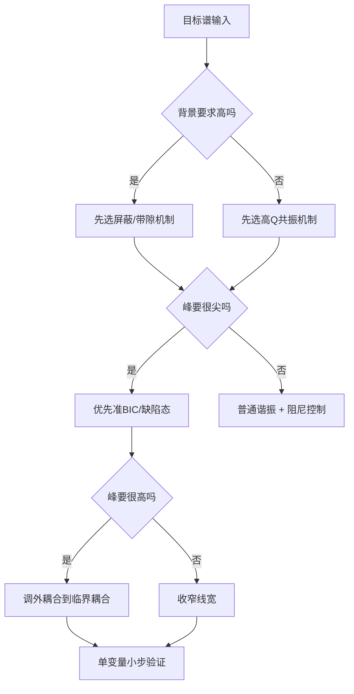

# 继续优化与逆向设计指南

## 1. 当前可保留的最佳基线

当前最值得保留的不是“最复杂”的结构，而是这个已经被验证过的基线：

- 结构族：D4 双环八缝准 BIC 耦合腔
- 金属屏：Ag
- 金属厚度：90 nm
- 对角失谐：`eta = 6.60 nm`
- 屏蔽孔径宽度：36 nm
- 屏蔽孔径径向额外长度：110 nm

对应的最好结果：

- `peak_abs2 = 0.8327`
- `FWHM = 3.02 nm`
- `offband_p95 = 0.01031`

这说明当前结构已经接近“高峰、窄峰、低背景”的平衡点，但还没完全到你理想中的极致。

## 2. 现在不应该再做什么

下面这些动作都不应该继续无条件进行：

- 不要再盲目减薄金属厚度。
- 不要再单纯增大开口宽度。
- 不要再同时改多个变量。
- 不要再把 PEC 结果当成真实可制造结论。
- 不要再为了“试一试”去做没有理论理由的厚度/高度/材料扫参。

你已经用结果证明了这些方向里至少有一部分是无效的：

- Ag70 比 Ag90 差。
- 单纯增大 slit 宽度会抬背景。
- PEC 只适合作为上限诊断，不适合作为最终方案。

## 3. 下一步如果继续优化当前结构，优先级是什么

### 3.1 优先级 1：背景清理

当前 extra110 已经把峰抬到了不错的水平，下一步不应该只盯峰值，而应该盯背景。

目标是：

- 在不明显牺牲峰高的前提下，继续压低 `offband_p95`。

可以考虑的方向：

- 在金属屏蔽层中加入二级窄缝。
- 在屏蔽层上方增加极薄相位补偿层。
- 用局部介质加载去抑制残余直通通道。

这类操作的前提是：不能把高峰重新打坏。

### 3.2 优先级 2：峰位微调

如果后续目标是更精确地对准某个中心波长，那么优先调整：

- `eta`
- `inner_outer_shift`
- `screen_aperture_extra_length`

但必须一个变量一次，只看一个物理假设。

### 3.3 优先级 3：峰高再推进

如果你想把峰进一步推近 1，可以只做很小的局部验证：

- `extra_length` 在当前最优附近做微小步进。
- `eta` 做很小范围微调。
- 仅在背景没有明显恶化的前提下继续。

如果背景一上来就恶化，那就停止这条线。

## 4. 适合的继续优化策略

推荐采用“窄窗、单变量、小步长”的策略：

```text
先锁定当前最优结构
-> 只动一个变量
-> 每次只做 1 到 3 次有理由的验证
-> 看峰高和背景是否同时朝目标方向走
-> 如果不是，立即退回
```

对于这个项目，最合适的扫描不是大范围 sweep，而是：

- `extra_length` 小步微调
- `eta` 小步微调
- 背景抑制层的微结构微调

## 5. 如果要继续向“逆向设计”过渡

你后续的目标已经不是“找到一个能跑的结构”，而是“给定任意目标光谱，自动选结构族并反推参数”。

我建议把路线分成三层：

### 5.1 先做机制约束逆向设计

不是让优化器乱造结构，而是先限定结构族：

- D4 准 BIC
- DBR 缺陷腔
- 光子晶体缺陷态
- guided-mode resonance

每个目标光谱先判断最适合哪一类。

### 5.2 再做参数逆向设计

在固定结构族里做逆向：

- 峰位对应尺寸估算
- 峰高对应耦合强度
- 背景对应屏蔽强度

### 5.3 最后做局部细化

只对已经近似成功的结构做小范围修正。

## 6. 一个实用的决策树



## 7. 以后做任意中心波长时，应该怎么迁移

如果未来你要换中心波长，不要先改一堆几何细节，先按下面顺序走：

1. 用公式估算主尺度。
2. 保持机制不变。
3. 只改和波长最直接相关的尺寸。
4. 再做局部耦合微调。

最重要的是：不要把“换中心波长”误做成“换一套完全没逻辑的结构”。

## 8. 推荐的后续工作方向

### 方向 A: 当前结构的背景清理

适合现在继续做，目标是把 `offband_p95` 再压低一些，同时尽量保住 `peak_abs2 > 0.8`。

### 方向 B: 逆向设计框架化

把这次的思考抽象成工具：

- 输入目标光谱
- 自动匹配机制
- 自动选结构族
- 自动初始化参数
- 自动单线程仿真
- 自动生成物理报告

### 方向 C: 结构族扩展

以后不是只做 D4，也可以扩展到：

- DBR 缺陷腔
- 纯介质准 BIC
- 光子晶体 slab
- 多层相位补偿腔

但每次都要先看目标是不是适合这个机制。

## 9. 最后原则

这次项目已经证明一件事：最有效的优化不是“多试”，而是“每次只验证一个有物理意义的假设”。

以后继续做这个方向时，建议始终保持下面三条：

- 有依据再改。
- 一次只改一个主变量。
- 每次结果都要能解释为什么会这样。

