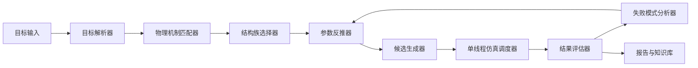

# 自动目标光谱到结构优化系统畅想

## 1. 这个系统要解决什么

你真正想要的不是“我来给出一个结构”，而是一个能持续工作的系统：

```text
用户输入目标光谱
-> 系统自动判断可行物理机制
-> 自动选结构族
-> 自动生成候选结构
-> 自动做单线程仿真验证
-> 自动反推下一轮
-> 形成可复用设计知识库
```

这个系统的价值在于，它不是只对一次任务有效，而是可以把“思考过程”本身抽象成流程。

## 2. 输入应该长什么样

最小输入不应只是“我要一个尖峰”，而应该至少包含这些字段：

```yaml
target:
  center_wavelength_nm: 1330
  peak_type: transmission_upward
  peak_height_min: 0.8
  fwhm_max_nm: 3.5
  background_p95_max: 0.01
  bandwidth_nm: [900, 1700]
  symmetry_preference: D4
  allowed_materials: [Si, SiO2, Ag]
  fabrication_bias: "prefer manufacturable"
  simulation_budget: "single-thread"
```

如果用户只输入“任意光谱”或“中心波长”，系统必须先追问或自动补齐：

- 是透射峰还是反射谷？
- 背景要压到什么程度？
- 可用材料有哪些？
- 是否允许金属？
- 允许的尺寸范围是多少？

否则系统会在一个不完整目标上乱跑。

## 3. 系统架构



## 4. 机制库应该怎么设计

系统不能只靠“参数优化器”，必须有一个机制库。机制库按目标分层：

### 4.1 低背景机制

- 金属屏蔽层
- 光子带隙结构
- DBR 缺陷腔
- 高反射腔
- 亚波长等效禁带结构

### 4.2 高 Q 机制

- 对称保护 BIC / 准 BIC
- Friedrich-Wintgen 干涉 BIC
- EIT-like 暗亮模耦合
- whispering-gallery-like 环形暗模
- guided-mode resonance

### 4.3 外耦合机制

- 对称破缺失谐
- 开口尺寸
- 相位补偿层
- 阻抗匹配层
- 多端口耦合设计

系统要做的不是“猜结构”，而是先判断这个目标最适合哪一种机制组合。

## 5. 自动匹配逻辑

一个实际可用的决策顺序应该是：

1. 先判断目标是“峰”还是“谷”。
2. 再判断要不要强背景抑制。
3. 再判断是否需要高 Q 模。
4. 再判断能否用对称性机制解释。
5. 再判断是否需要金属、DBR、光子晶体或纯介质方案。

示意规则：

```text
如果背景必须很低 -> 先找带隙/屏蔽机制
如果峰必须很尖 -> 再找高Q暗模机制
如果峰必须高 -> 再找临界耦合机制
如果目标光谱很单一 -> 限制自由度，减少可出现的多峰态
```

## 6. 系统应该自动考虑的事

这是用户通常不会一次性想到、但系统必须内置的部分：

### 6.1 目标歧义

“干净”“尖”“强”这些词都太模糊，系统必须转成数值门槛：

- `peak_height_min`
- `fwhm_max_nm`
- `background_p95_max`
- `side_peak_count_max`

### 6.2 归一化问题

不同软件里的谱线可能是：

- 功率透射 `T`
- 场比 `|T|`
- 场比平方 `|T|^2`

系统必须显式记录数据定义，否则会把“看起来很高的峰”误判。

### 6.3 收敛与仿真预算

自动化系统如果不懂收敛，就会产出很多漂亮但不可信的图。

必须内置：

- 网格收敛检查
- 自动关断监控
- 发散检测
- 单线程队列
- 失败样本保留

### 6.4 版本与溯源

每一次运行都要保存：

- 原始 `.fsp`
- 参数 JSON
- 结果图
- 结果表
- 运行日志
- 评分函数版本

否则后面无法判断“是结构变了，还是评分逻辑变了”。

## 7. 结果评估器应该怎么工作

不能只看峰高。建议至少是多目标：

```text
score = w1 * peak_height
      - w2 * background_p95
      - w3 * FWHM
      - w4 * side_peak_count
      - w5 * edge_penalty
```

并且要有硬阈值：

- 如果出现多个高旁峰，则直接判失败。
- 如果峰贴近扫描边界，则判失败。
- 如果仿真发散，则判失败。

## 8. 人机协作方式

这个系统最合理的不是完全无人，而是“人定方向，系统做搜索”。

推荐模式：

1. 人输入目标光谱和约束。
2. 系统给出 2 到 4 个物理机制候选。
3. 人选择机制或给出偏好。
4. 系统生成少量有理论依据的候选结构。
5. 系统逐个单线程仿真。
6. 系统根据结果只改一个主变量。

这样做的好处是：

- 避免无意义扫参。
- 避免把复杂任务交给黑箱优化器。
- 让每次失败都能转化为知识。

## 9. 一个可实施的产品形态

我建议这个系统做成三层：

### 9.1 前端

用户输入：

- 目标谱形
- 波长范围
- 峰位
- 峰高
- 背景约束
- 允许材料
- 工艺限制

### 9.2 中间层

自动执行：

- 机制识别
- 结构族推荐
- 参数初始化
- 仿真排队
- 结果判定

### 9.3 输出层

输出三类东西：

- 一个结构建议
- 一个仿真记录
- 一份“为什么这个结构有效”的物理报告

## 10. 我认为最关键的补充

如果你后面真要做成一个长期工具，最关键的不是优化器，而是“机制知识库”。

每次成功或失败，都应记录：

- 目标类型
- 用了什么机制
- 为什么选它
- 哪个变量最敏感
- 失败模式是什么
- 哪个变量不应该再碰

久而久之，系统不只是会跑仿真，而是会形成自己的设计经验。

