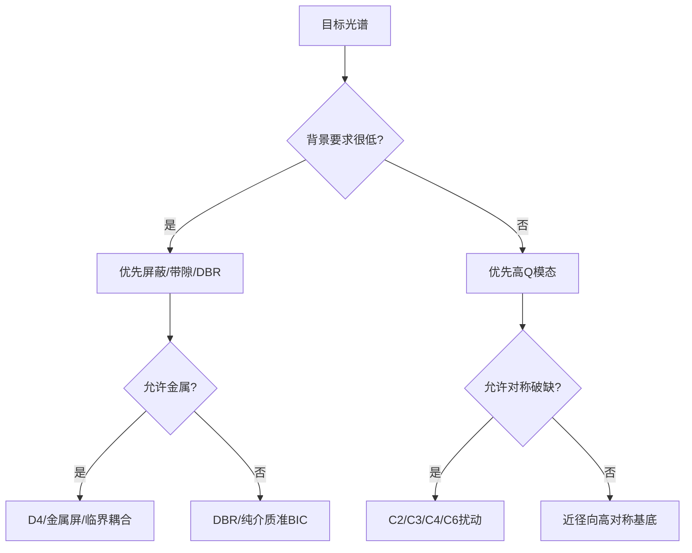

# 机制与谱型总表

这份文档面向 AI。核心目的只有一个：当用户给出目标光谱时，先判断应该调用什么物理机制，而不是先随机改结构。

## 1. 目标先分型

先把目标谱拆成四个独立问题：

- 背景是否必须很低。
- 峰是否必须很尖。
- 峰是否必须很高。
- 是否允许多峰、旁峰或宽带起伏。

对应到物理量：

```text
背景 -> 带隙 / 屏蔽 / 直通通道
峰尖 -> Q 值 / 辐射泄漏 / 准 BIC
峰高 -> 外耦合 / 临界耦合 / 吸收损耗
多峰 -> 模态选择性 / 对称性 / 旁模抑制
```

## 2. 机制选择总表

| 目标类型 | 优先机制 | 适合结构族 | 备注 |
|---|---|---|---|
| 单一尖峰，背景近零 | 金属屏蔽 + 准 BIC + 临界耦合 | D4、C4、部分 C6 | 最适合做“只保留一个高峰” |
| 单一尖峰，纯介质为主 | 对称保护 BIC / 准 BIC | C4、C6、近径向高对称 | 背景通常比金属屏低得慢，但损耗更小 |
| 宽背景上做窄带透射窗口 | EIT-like 暗亮模耦合 | C2、C3、C4 | 结构解释清晰，容易调耦合 |
| 多个窄峰中的一个是目标 | 模态筛选 + 旁峰压制 | DBR、chirped 结构 | 必须额外检查 side peaks |
| 需要高反射背景 | 光子带隙 / DBR / 屏蔽层 | DBR、金属屏结构 | 适合先压背景，再开窄带通道 |

## 3. 机制和谱形的对应关系

### 3.1 对称保护 BIC / 准 BIC

适合：

- 你要一个很窄的峰。
- 你能接受通过小扰动打开辐射。
- 你想明确解释“为什么这个峰会出现”。

典型标度：

```text
delta = perturbation / characteristic_length
gamma_rad proportional to delta^2
Q_rad proportional to 1/delta^2
```

结论：

- `delta` 太小，峰可能太弱。
- `delta` 太大，峰会变宽，背景也可能上升。
- 最优点通常是临界耦合附近，不是最大扰动处。

### 3.2 金属屏蔽 + 开口耦合

适合：

- 目标是“背景干净”。
- 需要先压掉直通通道。
- 结构允许引入金属层。

判断逻辑：

- 金属层太薄，背景会漏。
- 金属层太厚，吸收和相位可能把峰压死。
- 因此厚度不是越薄越好，必须和开口长度、宽度一起看。

### 3.3 DBR 缺陷腔

适合：

- 你想要高反射背景 + 缺陷窄峰。
- 结构更像多层膜，而不是平面超表面。

基础公式：

```text
d_H = lambda_c / (4*n_H)
d_L = lambda_c / (4*n_L)
d_cavity = m*lambda0 / (2*n_cavity)
```

风险：

- 容易出现多个高旁峰。
- 不能只用 p95 判断。
- 必须检查 side peak 数量和峰间距。

### 3.4 近径向高对称结构

适合：

- 想从圆盘/圆环出发做 WGM-like 或角向模态。
- 想要更自然的径向尺寸估算。

风险：

- 若不做合适破缺，峰常常偏弱或者偏离目标波段。
- 这种结构更像“高对称基底”，不是最直接的高峰终点。

## 4. 结构族和机制的最佳匹配

| 结构族 | 最适合的机制 | 最适合的谱目标 | 不适合的情况 |
|---|---|---|---|
| C2 | 最小对称破缺、简单 EIT-like | 双峰分裂、偏振敏感谱、简单窄峰 | 想要极强背景压制时 |
| C3 | 角向模态控制、单裂缝诱导泄漏 | 单峰/少峰、角度敏感响应 | 需要超强单峰背景抑制时 |
| C4 | 准 BIC、角向选择性、清晰的 C4→C2→C1 路径 | 单一尖峰、结构解释性强 | 想一次性扫很多自由度时 |
| C6 | 高阶角向模态、复杂对称选择 | 多阶模态、角向规则更强 | 需要非常简单的参数解释时 |
| 近径向高对称 | WGM-like、圆对称模式 | 平滑、连续、径向模式主导 | 想直接得到高对比单峰时 |
| D4 准 BIC 复合结构 | 屏蔽 + 暗模 + 临界耦合 | 低背景、高峰、窄峰三者兼顾 | 不允许金属层或不允许复杂几何时 |

## 5. 经验判断规则

如果用户要的是：

- **背景特别干净**：优先找带隙、屏蔽层、DBR、金属隔离。
- **峰特别尖**：优先找准 BIC、对称保护模、WGM-like 暗模。
- **峰特别高**：优先调外耦合到临界耦合，而不是继续减小扰动。
- **只允许一个峰**：优先选对称性清晰、自由度少的结构族。
- **需要好解释**：优先选 C2/C4/D4 这类降群路径明确的家族。
- **需要更低吸收损耗**：优先纯介质或近径向高 Q 方案。

## 6. 什么时候不要继续扫参数

以下情况说明你已经不该继续原地扫参：

- 峰已经不再随单变量单调变化。
- 背景开始明显抬升。
- 峰高改善小于背景恶化。
- 峰位开始贴扫描边界。
- 同一机制连续两次都失败。

这时应切换机制，而不是继续调数字。

## 7. 决策图



